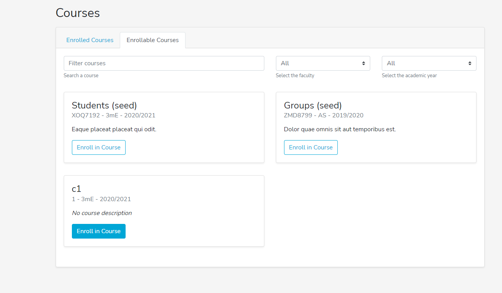
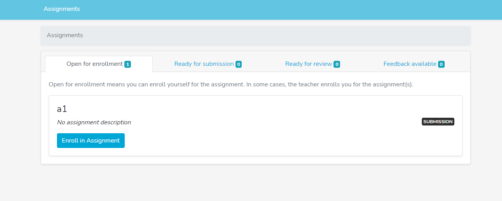
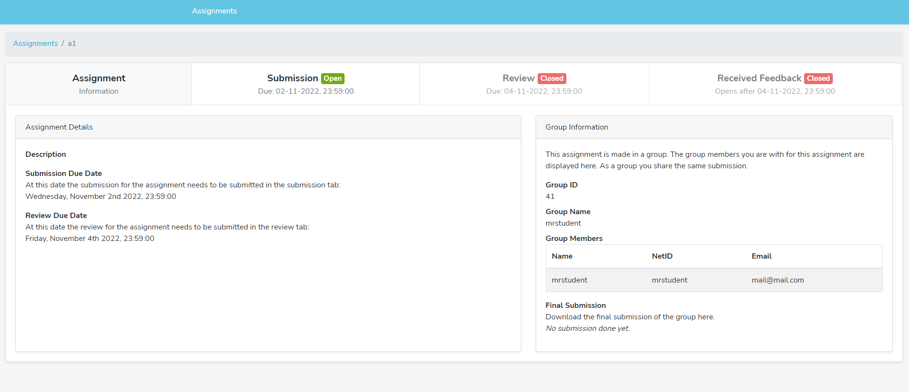
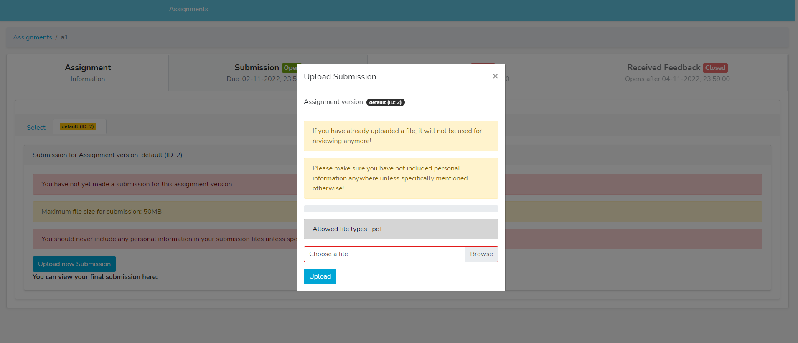
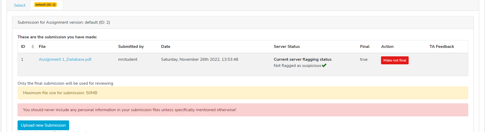
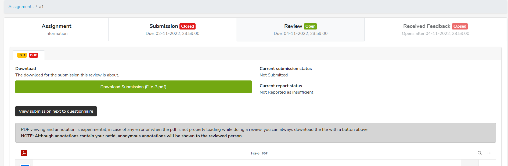
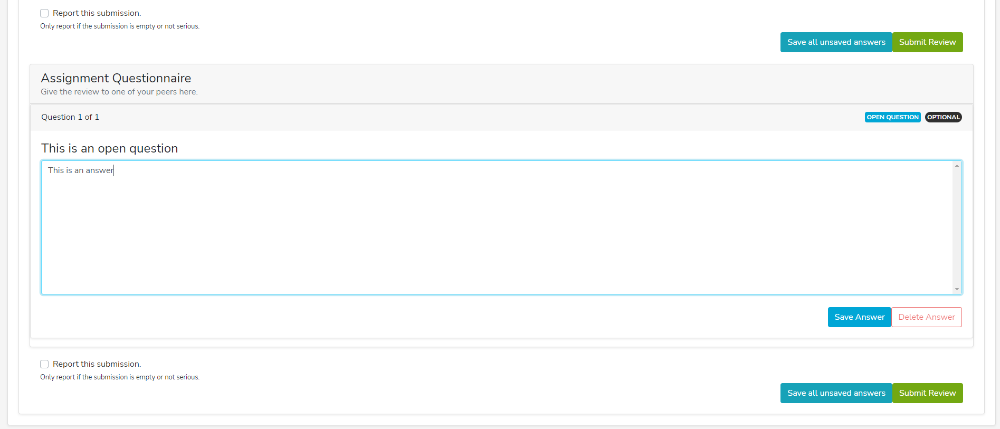
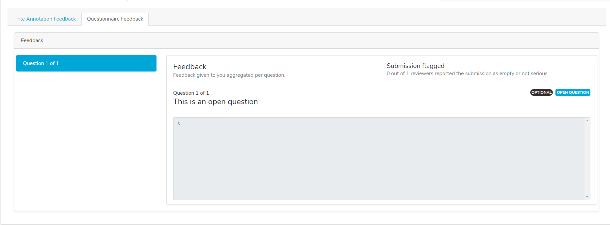

# Student Workflow
## Introduction
The student workflow consists of: 
1. Enrolling in the course
2. Selecting the assignment to submit
3. Submitting the assignment
4. Reviewing someone else's assignment
5. Filling out the submission questionnaire
## Enrolling in the course
Click the course button on the top left of the Peer homepage and click on the `Enrollable Courses` tab:

## Selecting the assignment to submit
Click `Enroll in Course`, switch tabs to `Enrolled Courses`, and `Enter Course` to access the assignments of that course:

Click `Enroll in Assignment`, switch tabs to `Ready for submission`, and `View assignment` to see assignment details:

## Submitting the assignment
Switch to the `submissions` tab, select the assignment version, and select `Upload new Submission` which will show you a prompt to select your submission file:

After, selecting your file and uploading it, you can choose to upload a different submission file (by clicking `make not final`) or to keep the one you just uploaded as the final submission:

## Reviewing someone else's assignment
After switching to the `Review` tab, it is possible to annotate the submission (which the submitter will be able to see once they get their reviews back):

If a submission questionnaire was made by the teacher, this should be visible below the submission, where you can fill out the form and click `Save all unsaved answers` to save answers before clicking `Submit Review`:

After the feedback has been released, you can see the review annotations and the submission questionnaire answers of the reviewer by selecting their respective tabs:
 
